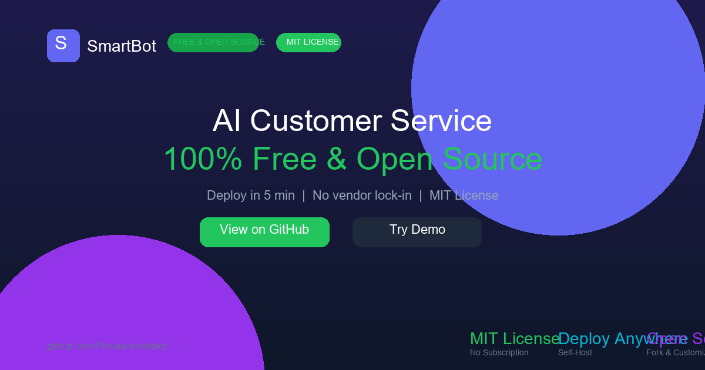
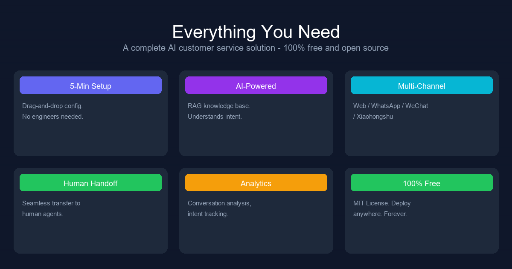
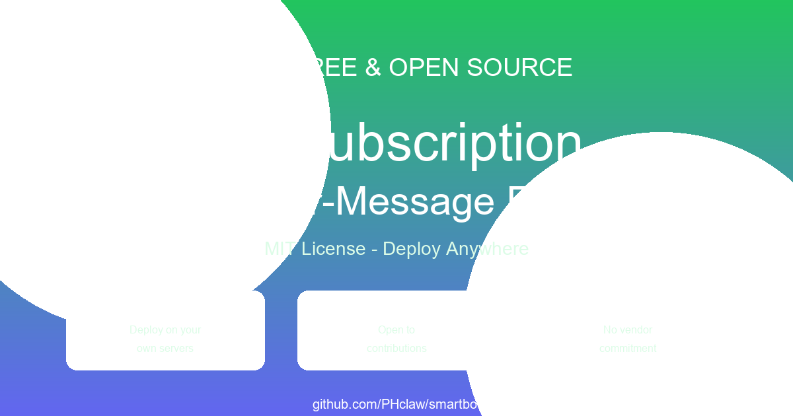
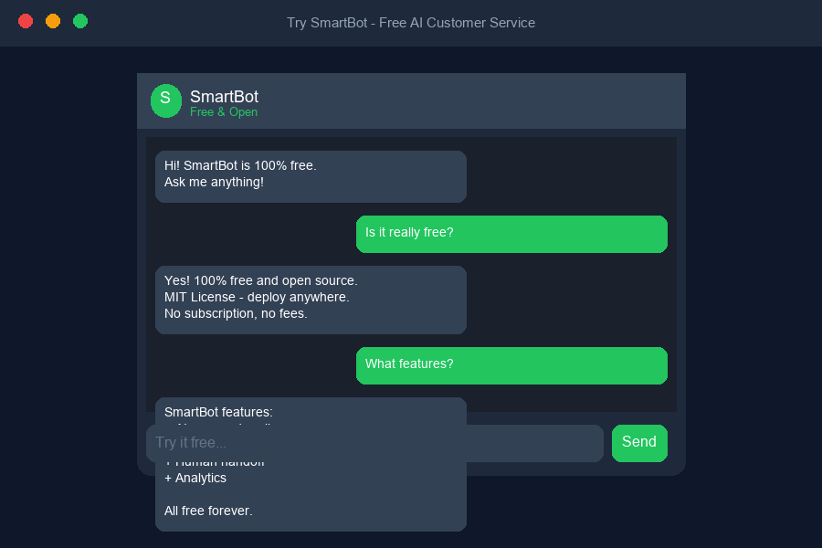

<div align="center">

# SmartBot

**Free & Open Source AI Customer Service Platform**

Deploy your AI customer service bot in 5 minutes. No subscription. No vendor lock-in.

[](LICENSE)
[](https://python.org)
[](https://fastapi.tiangolo.com)
[](https://react.dev)
[](https://github.com/PHclaw/smartbot)

</div>

---



---

## ✨ Features



- 🤖 **AI-Powered Replies** — RAG knowledge base, understands intent like a real agent
- 💬 **Multi-Channel** — Web Widget / WhatsApp / WeChat / Xiaohongshu
- 🚀 **5-Min Setup** — Drag-and-drop config, no engineers needed
- 🔓 **100% Free & Open Source** — MIT License, deploy anywhere, own your data
- 🔄 **Human Handoff** — Seamless transfer to human agents when needed
- 📊 **Analytics** — Conversation analysis, intent tracking, satisfaction scores

---

## 🆓 Free & Open Source



SmartBot is completely free. No hidden fees, no usage limits, no vendor lock-in.
Self-host it on your own server and own your data.

---

## 🖥️ Demo



---

## 🏗️ Tech Stack

| Layer | Tech |
|-------|------|
| Backend | FastAPI + SQLAlchemy (async) |
| Database | PostgreSQL + pgvector |
| Queue | Redis + Celery |
| LLM | OpenAI / Anthropic / DeepSeek |
| Frontend | React 18 + TypeScript + Vite |
| Styling | Tailwind CSS |

---

## 🚀 Quick Start

### Prerequisites
- Python 3.11+
- Node.js 18+
- PostgreSQL 16+
- Redis 7+

### Backend

```bash
git clone https://github.com/PHclaw/smartbot.git
cd smartbot/backend

python -m venv venv
source venv/bin/activate        # Linux/Mac
.\venv\Scripts\activate         # Windows

pip install -r requirements.txt
cp .env.example .env            # fill in your API keys
uvicorn app.main:app --reload --port 8000
```

### Frontend

```bash
cd frontend
npm install
npm run dev
# Visit http://localhost:5174
```

### Docker (one command)

```bash
docker-compose up -d
```

---

## 📁 Project Structure

```
smartbot/
├── backend/
│   ├── app/
│   │   ├── api/              # REST API routes
│   │   │   ├── auth.py       # JWT authentication
│   │   │   ├── bots.py       # Bot management
│   │   │   ├── conversations.py
│   │   │   └── knowledge.py  # RAG knowledge base
│   │   ├── core/             # Config & database
│   │   └── models/           # SQLAlchemy models
│   ├── requirements.txt
│   └── .env.example
├── frontend/
│   └── src/
│       └── App.tsx           # Landing page
├── promo_images/             # Promotional assets
├── docker-compose.yml
└── README.md
```

---

## 🤝 Contributing

PRs are welcome! Feel free to open an issue or submit a pull request.

1. Fork the repo
2. Create your feature branch (`git checkout -b feature/amazing-feature`)
3. Commit your changes (`git commit -m 'Add amazing feature'`)
4. Push to the branch (`git push origin feature/amazing-feature`)
5. Open a Pull Request

---

## 📄 License

MIT License — see [LICENSE](LICENSE) for details.

---

<div align="center">

**If this project helps you, please give it a ⭐**

[](https://github.com/PHclaw/smartbot)

</div>
